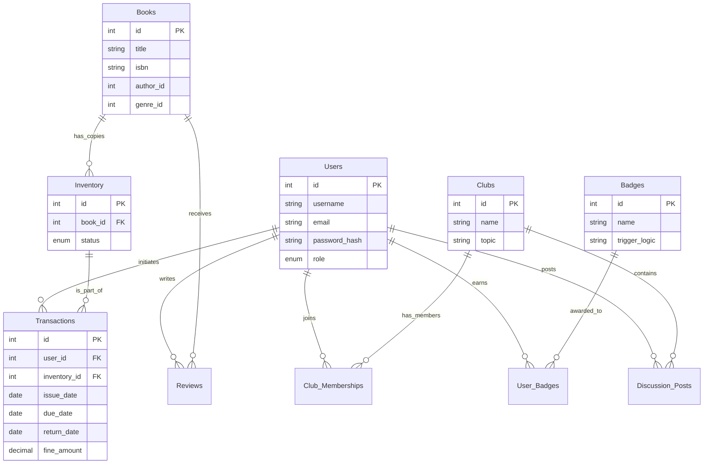

# LMS Implementation Plan

## Goal Description
Build a comprehensive Library Management System (LMS) with advanced database features, a clean React/Next.js frontend, and a Node.js backend. Key focus areas are relational design, gamification, and community features.

## User Review Required
> [!IMPORTANT]
> Please review the proposed SQL Schema and ER approach below. The recommendation engine logic relies heavily on the `Transactions` and `Ratings` tables.

## Proposed Changes

### Database Layer (PostgreSQL)
We will use PostgreSQL for its robust JSON support and advanced relational capabilities.

#### Schema Overview
- **Users**: `id`, `username`, `email`, `password_hash`, `role` (enum: 'admin', 'librarian', 'member'), `created_at`
- **Books**: `id`, `title`, `author_id`, `genre_id`, `isbn`, `publication_year`, `description`
- **Inventory** (`book_copies`): `id`, `book_id`, `status` (available, lost, maintenance) - *Tracks physical copies*
- **Transactions**: `id`, `user_id`, `inventory_id`, `issue_date`, `due_date`, `return_date`, `fine_amount`
- **Badges**: `id`, `name`, `description`, `trigger_logic`
- **User_Badges**: `user_id`, `badge_id`, `awarded_at`
- **Clubs**: `id`, `name`, `topic`, `description`
- **Club_Memberships**: `club_id`, `user_id`, `joined_at`
- **Discussion_Posts**: `id`, `club_id`, `user_id`, `content`, `created_at`
- **Reviews**: `id`, `book_id`, `user_id`, `rating` (1-5), `comment`, `created_at`

#### ER Diagram

```mermaid
erDiagram
    Users ||--o{ Transactions : initiates
    Users ||--o{ Club_Memberships : joins
    Users ||--o{ User_Badges : earns
    Users ||--o{ Reviews : writes
    Users ||--o{ Discussion_Posts : posts
    
    Books ||--o{ Inventory : has_copies
    Books ||--o{ Reviews : receives
    
    Inventory ||--o{ Transactions : is_part_of
    
    Clubs ||--o{ Club_Memberships : has_members
    Clubs ||--o{ Discussion_Posts : contains
    
    Badges ||--o{ User_Badges : awarded_to

    Users {
        int id PK
        string username
        string email
        string password_hash
        enum role
    }

    Books {
        int id PK
        string title
        string isbn
        int author_id
        int genre_id
    }

    Inventory {
        int id PK
        int book_id FK
        enum status
    }

    Transactions {
        int id PK
        int user_id FK
        int inventory_id FK
        date issue_date
        date due_date
        date return_date
        decimal fine_amount
    }

    Badges {
        int id PK
        string name
        string trigger_logic
    }

    Clubs {
        int id PK
        string name
        string topic
    }
```

### Backend (Node.js/Express)
- **API Structure**: RESTful API.
- **Key Modules**:
    - `auth`: JWT based authentication.
    - `dashboard`: Aggregates user data (loans, fines).
    - `recommendations`: Executes complex SQL queries to fetch suggested books.

### Frontend (Next.js)
- **Framework**: Next.js 14 (App Router) with Tailwind CSS.
- **Components**:
    - `Dashboard`: Stat cards, active loan table.
    - `BookClub`: Forum-style layout.
    - `BookDetail`: Reviews, ratings, and "You might also like" section.

## Verification Plan
### Automated Tests
- Unit tests for fine calculation logic.
- Integration tests for API endpoints.

### Manual Verification
- Verify database foreign key constraints by attempting invalid inserts.
- Check "Days Remaining" calculation on the dashboard against various `due_date` scenarios.
