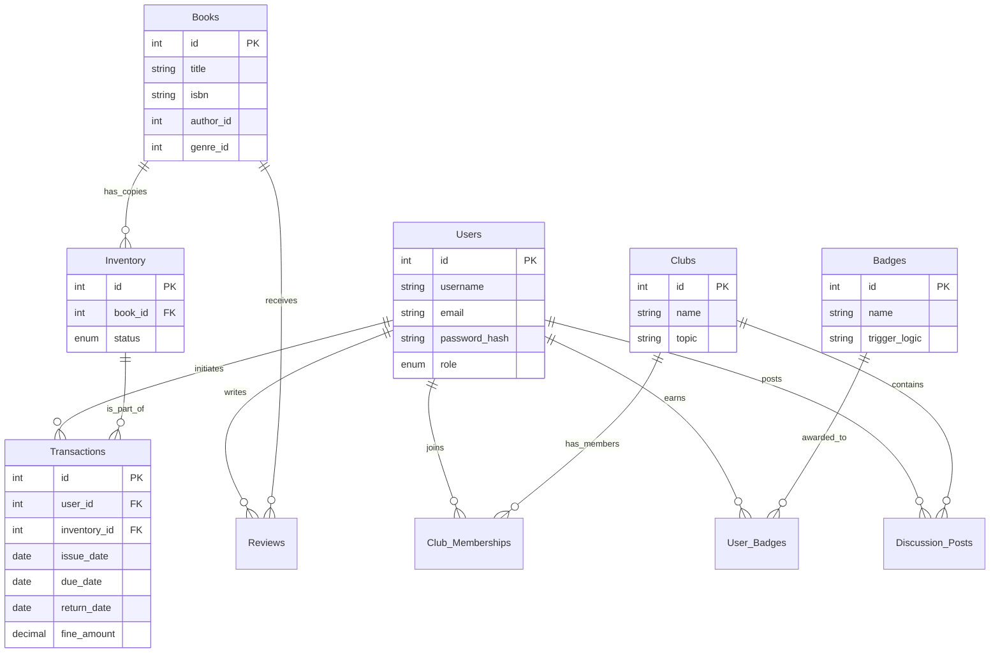

# Library Management System Implementation Plan

## Goal Description
Build a robust Library Management System (LMS) with real-time inventory management, personalized recommendations, and a community dashboard.

> [!IMPORTANT]
> **Database Decision: SQLite**
> To ensure the application runs immediately without complex environment setup or connection errors, we are using **SQLite**.
> - **Zero Config**: No external service installation required.
> - **Same Features**: Supports all relational logic, inventory counts, and transactions.
> - **Local Storage**: Data is stored in `backend/data/lms.db`.

## User Review Required
> [!IMPORTANT]
> Please review the proposed SQL Schema and ER approach below. The recommendation engine logic relies heavily on the `Transactions` and `Ratings` tables.

## Proposed Changes

### Database Layer (PostgreSQL)
We are using PostgreSQL as the primary database. We will implement a seeding mechanism to populate the database with initial books and ensure 5 copies of each are available in the inventory.

#### [MODIFY] [db.js](file:///c:/Users/SHIVANI/Downloads/ShineShelf-main/ShineShelf-main/backend/src/config/db.js)
Reverting to `pg` for PostgreSQL connectivity.

#### [NEW] [seed.js](file:///c:/Users/SHIVANI/Downloads/ShineShelf-main/ShineShelf-main/backend/src/config/seed.js)
New seeding script to populate books with images and 5 physical copies per book.

#### Schema Overview
- **Users**: `id`, `username`, `email`, `password_hash`, `role` (enum: 'admin', 'librarian', 'member'), `created_at`
- **Books**: `id`, `title`, `author_id`, `genre_id`, `isbn`, `publication_year`, `description`
- **Inventory** (`book_copies`): `id`, `book_id`, `status` (available, lost, maintenance) - *Tracks physical copies*
- **Transactions**: `id`, `user_id`, `inventory_id`, `issue_date`, `due_date`, `return_date`, `fine_amount`
- **Badges**: `id`, `name`, `description`, `trigger_logic`
- **User_Badges**: `user_id`, `badge_id`, `awarded_at`
- **Clubs**: `id`, `name`, `topic`, `description`
- **Club_Memberships**: `club_id`, `user_id`, `joined_at`
- **Discussion_Posts**: `id`, `club_id`, `user_id`, `content`, `created_at`
- **Reviews**: `id`, `book_id`, `user_id`, `rating` (1-5), `comment`, `created_at`

#### ER Diagram

### Backend (Node.js/Express)
- **API Structure**: RESTful API.
- **Key Modules**:
    - `auth`: JWT based authentication (Login/Register).
    - `books`: [NEW] Fetch real book list with availability status.
    - `transactions`: Handle borrowing and returning books (using atomic transactions).
    - `dashboard`: Aggregates user data (loans, fines).
    - `recommendations`: Executes complex SQL queries to fetch suggested books.

### Frontend (Next.js)
- **Framework**: Next.js 14 (App Router) with Tailwind CSS.
- **Components**:
    - **[NEW] Login Page**: `/login` route with form for email/password.
    - `Dashboard`: Stat cards, active loan table.
    - `BookClub`: Forum-style layout.
    - `BookDetail`: Reviews, ratings, and "You might also like" section.
    - **[MODIFY] Books Catalogue**: Fetch live data from `/api/books` instead of mock data.
    - **[NEW] Transactions**: UI to borrow books (from list) and return books (from dashboard).

## Specific Book Covers & Fallback UI
To provide a premium experience, we will:
- **Use Official Covers**: Update `seed.js` with specific, high-quality cover images for the curated book list.
- **Calligraphy Fallback**: Implement a stylized `BookCover` component that displays the book title in an elegant font (Dancing Script/Playfair Display) if the image URL is broken or missing.

## Mandatory Authentication Flow
- **Login First Policy**: The root route (`/`) will strictly redirect unauthenticated users to `/login` immediately before any dashboard data is fetched.
- **Protected Routes**: Ensure all main application pages (Dashboard, Books, Clubs) check for session existence.

## Verification Plan
### Automated Tests
- Unit tests for fine calculation logic.
- Integration tests for API endpoints.

### Manual Verification
- **Login Flow**: Verify user can login and receive JWT.
- **Borrowing**: Verify a user can borrow a book and it appears in "Active Loans".
- **Returning**: Verify a user can return a book and the transaction is closed.
- **Constraints**: Verify database foreign key constraints by attempting invalid inserts.
- **Calculations**: Check "Days Remaining" calculation on the dashboard against various `due_date` scenarios.
